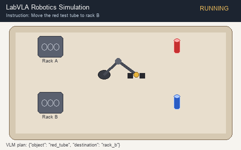
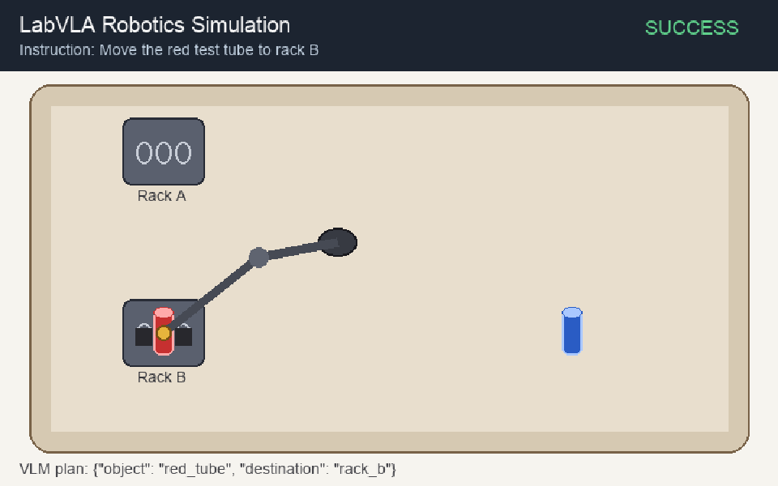

# LabVLA Robotics Simulation

This is a Python project for language-guided laboratory robotics in simulation. 

For an example, we give a natural-language instruction like **"Move the red test tube to rack B"**. The system looks at the simulated lab table through a camera, turns the instruction into a structured task plan with a Vision-Language Model (VLM), and a virtual Franka Panda arm runs pick-and-place. A lightweight world model then predicts the next low-dimensional state.

This is a Mac-friendly prototype of a VLM → controller → world model pipeline for lab automation. It is not a full end-to-end production VLA yet. The VLM plans; a controller executes. A true VLA action head is a later extension.

### Demo



## Pipeline

```text
language instruction + camera image
        ↓
   VLM (mock / API / local)
        ↓
   task JSON {object, destination}
        ↓
   scripted / OSC controller
        ↓
   MuJoCo + robosuite (Panda)
        ↓
   trajectory log
        ↓
   lightweight world model
```

## Project layout

```text
labvla/
  env/            simulation environment interface
  vlm/            vision-language planning backends
  controller/     robot control
  world_model/    next-state prediction
  viz/            demo frame rendering and GIF export
  pipeline.py     end-to-end wiring
assets/           demo.gif
configs/          default demo config
scripts/demo.py   runnable mock demo
```

## Tech stack

| Piece | Choice |
|---|---|
| Language | Python |
| Physics / robot sim | MuJoCo + robosuite |
| Robot | Franka Panda |
| Perception + language | Pluggable VLM (`mock` now; API / local later) |
| Control | Scripted pick-and-place first |
| World model | Lightweight NumPy MLP over low-dimensional state (PyTorch optional later) |

Built to run on a Mac without an NVIDIA GPU.

## Quick start

```bash
python3 -m venv .venv
source .venv/bin/activate
pip install -e .
```

### Run live locally

From the project root, with the venv activated, we can run codes to iniitaite live demo locally using following command without parameters.

```bash
python scripts/demo.py
```

This is the default mode. A matplotlib window opens and you watch the mock Franka Panda pick-and-place in real time (instruction → VLM plan → scripted controller). Close the window when the run finishes to exit.

Optional flags:

| Flag | Effect |
|---|---|
| `--gif` | Also write `assets/demo.gif` after the live run |
| `--gif path/to/out.gif` | Write the GIF to a custom path |
| `--fps 10` | Change live playback speed (default: 12) |
| `--config path/to.yaml` | Use a different config |

## Status

Runnable mock pipeline with live window (and optional GIF): mock lab scene, mock VLM, scripted controller, and world-model module. Next: real robosuite scene, then optional API / local VLM backends.


